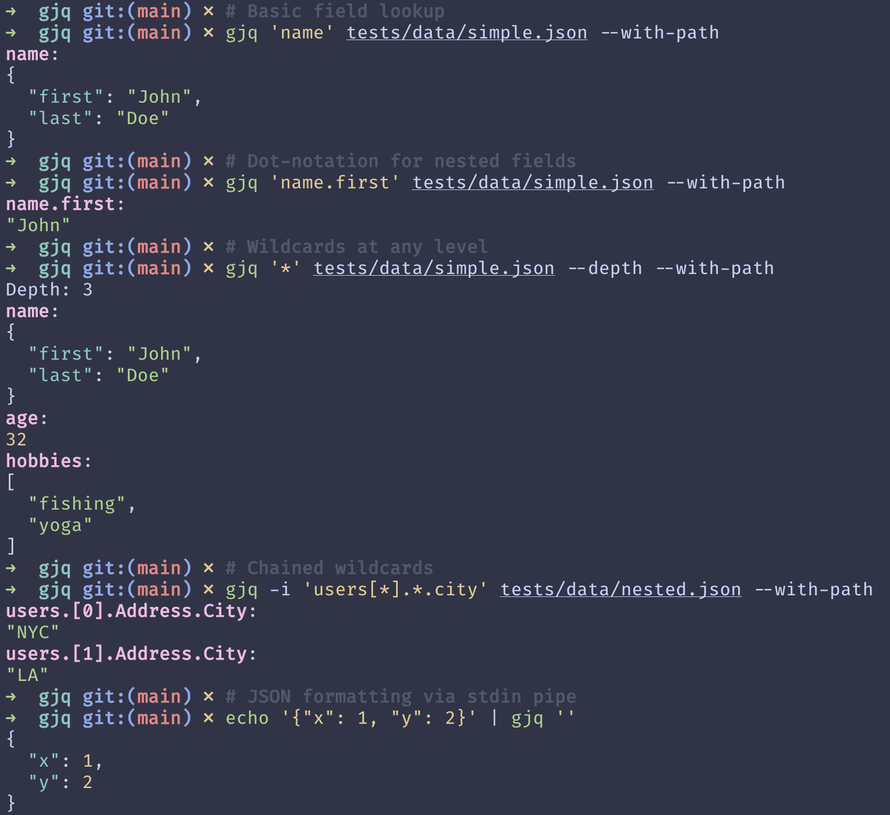

# gjq - Go JSON Query

`gjq` is a go-based CLI tool for querying JSON using *regular path queries*

<p align="center">
  
</p>


## What is gjq?

Think of a JSON document as a labeled graph — keys and indices form the edges, and the values are the nodes. gjq gives you a compact pattern language for describing which edges to follow, borrowing the familiar building blocks of regular expressions (alternation, wildcards, repetition) and applying them to tree traversal instead of string matching.

Rather than chaining filters step-by-step (the approach jq takes), you write a single declarative pattern that describes your destination. Internally, the pattern is compiled into a deterministic finite automaton that walks the document in one pass.

## How gjq differs from jq

jq's pipeline model is expressive, but simple "find this field" queries often require boilerplate like `.. | .field? // empty`. gjq flips the model: you specify *what* to match, and the engine handles the traversal.

### Deep field lookup

```bash
# gjq — the -F flag treats the argument as a plain field name and searches the entire tree
$ curl -s 'https://randomuser.me/api/?results=5000&inc=name,location,email,login,dob,registered,phone,picture,nat' \
  | gjq -F first | head -6
results.[0].name.first:
"Charles"
results.[1].name.first:
"Joel"
results.[2].name.first:
"Anthony"
```

```bash
# jq — recursive descent with manual null suppression
$ curl -s 'https://randomuser.me/api/?results=5000&inc=name,location,email,login,dob,registered,phone,picture,nat' \
  | jq '.. | .first? // empty' | head -3
"Charles"
"Joel"
"Anthony"
```

One thing to notice: gjq prints the full path to each match (e.g. `results.[0].name.first:`), so you always know *where* a value came from. jq strips that context. (Paths are shown when output goes to a terminal; piped output omits them by default. Toggle with `--with-path` / `--no-path`.)

### Matching multiple keys

```bash
# gjq — alternation inside parentheses
$ curl -s 'https://randomuser.me/api/?results=5000&inc=name,location,email,login,dob,registered,phone,picture,nat' \
  | gjq 'results[0].(nat|email)'
results.[0].nat:
"DE"
results.[0].email:
"charles.kuhne@example.com"
```

```bash
# jq — enumerate each key separately
$ curl -s 'https://randomuser.me/api/?results=5000&inc=name,location,email,login,dob,registered,phone,picture,nat' \
  | jq '.results[0] | .nat, .email'
"DE"
"charles.kuhne@example.com"
```

### Tallying results

```bash
# gjq
$ curl -s 'https://randomuser.me/api/?results=5000&inc=name,location,email,login,dob,registered,phone,picture,nat' \
  | gjq -F first --count -n
Found matches: 5000
```

```bash
# jq
$ curl -s 'https://randomuser.me/api/?results=5000&inc=name,location,email,login,dob,registered,phone,picture,nat' \
  | jq '[.. | .first? // empty] | length'
5000
```

### Formatting JSON (analogous to jq '.')

```bash
$ echo '{"name":"Ada","age":36}' | gjq ''
{
  "name": "Ada",
  "age": 36
}
```

## Installation

### go install (recommended)

Requires [Go 1.21+](https://go.dev/dl/).

```bash
go install github.com/fantods/gjq@latest
```

This places a `gjq` binary in `$GOPATH/bin` (or `$HOME/go/bin` by default). Make sure that directory is on your `PATH`.

### Build from source

```bash
git clone https://github.com/fantods/gjq.git
cd gjq
go build -o gjq .
```

### Verify

```bash
gjq --version
# gjq version 0.1.0
```

## CLI Usage

```
A JSONPath-inspired query language for JSON documents

Usage: gjq [OPTIONS] [QUERY] [FILE] [COMMAND]

Commands:
  generate  Generate additional documentation and/or completions

Arguments:
  [QUERY]  Query string (e.g., "**.name")
  [FILE]   Optional path to JSON file. If omitted, reads from STDIN

Options:
  -i, --ignore-case   Case insensitive search
      --compact       Do not pretty-print the JSON output
      --count         Display count of number of matches
      --depth         Display depth of the input document
  -n, --no-display    Do not display matched JSON values
  -F, --fixed-string  Treat the query as a literal field name and search at any depth
      --with-path     Always print the path header, even when output is piped
      --no-path       Never print the path header, even in a terminal
  -h, --help          Print help (see more with '--help')
  -V, --version       Print version
```

## Additional examples

**Pluck a field from anywhere in the structure:**

```bash
curl -s 'https://randomuser.me/api/?results=5000&inc=name,location,email,login,dob,registered,phone,picture,nat' \
  | gjq -F country | head -4
"Germany"
"Norway"
"Canada"
"United States"
```

**Count matches silently:**

```bash
curl -s 'https://randomuser.me/api/?results=5000&inc=name,location,email,login,dob,registered,phone,picture,nat' \
  | gjq -F first --count -n
# Found matches: 5000
```

**Combining with standard Unix tools:**

gjq adapts its output depending on whether it's writing to a terminal or a pipe — much like ripgrep's `--heading` behavior. In a terminal you get annotated paths; through a pipe you get raw values, making it straightforward to chain into `sort`, `uniq`, `wc`, and friends.

```bash
# Values only when piped — ready for downstream processing
$ curl -s 'https://randomuser.me/api/?results=5000&inc=name,location,email,login,dob,registered,phone,picture,nat' \
  | gjq -F nat | sort | uniq -c | sort -rn | head -5
 265 "ES"
 263 "RS"
 260 "MX"
 257 "FR"
 253 "US"

# Force path annotations on even when piped
$ curl -s 'https://randomuser.me/api/?results=5000&inc=name,location,email,login,dob,registered,phone,picture,nat' \
  | gjq -F first --with-path | head -4
results.[0].name.first:
"Charles"
results.[1].name.first:
"Joel"
```

## Benchmark

CLI wall-clock time comparing `gjq` to `jq` on test data (median of 20 iterations). Run with `./bench/bench.sh --chart`.

```
gjq  gjq version 0.1.0
jq   jq-1.8.1
Iterations: 20

Benchmark                      |   gjq (ms) |    jq (ms) |  Speedup
------------------------------------------------------------------------
results.nat                    |    13.87ms |    13.48ms |    0.97x
results.name.last              |    13.81ms |    13.58ms |    0.98x
recursive first                |     3.16ms |     3.16ms |    1.00x
recursive email (-F)           |     2.98ms |     3.23ms |    1.08x
results.location.country       |    13.71ms |    13.74ms |    1.00x
case-insensitive first         |     3.11ms |     3.12ms |    1.00x
simple: name                   |     3.17ms |     3.62ms |    1.14x
simple: name.first             |     3.08ms |     3.77ms |    1.22x
simple: hobbies[0]             |     3.22ms |     3.59ms |    1.11x
simple: wildcard *             |     3.07ms |     3.62ms |    1.18x
nested: users[*].name          |     3.03ms |     3.44ms |    1.14x
nested: deep recursive         |     2.87ms |     2.94ms |    1.02x
openapi: *.*.summary           |     3.05ms |     3.55ms |    1.16x
```

**Query details** (randomusers.json, 1 MB):

| Benchmark | gjq | jq |
|---|---|---|
| `results.nat` | `results[*].nat` | `.results[].nat` |
| `results.name.last` | `results[*].name[*].last` | `.results[].name.last` |
| `recursive first` | `**.first` | `[.. \| .first? // empty]` |
| `recursive email (-F)` | `-F email` | `[.. \| .email? // empty]` |
| `results.location.country` | `results[*].location[*].country` | `.results[].location.country` |
| `case-insensitive first` | `-i **.First` | `[.. \| .first? // empty]` |


## Query language reference

gjq queries are regular expressions applied to JSON paths rather than text. If you've used regex before, the operators will feel natural — they just operate on key and index segments instead of characters.

| Operator | Syntax | Meaning |
|---|---|---|
| Concatenation | `foo.bar.baz` | Follow the exact path `foo` → `bar` → `baz` |
| Alternation | `foo \| bar` | Accept either `foo` or `bar` |
| Kleene star | `**` | Zero or more field steps |
| Repetition | `foo*` | Repeat the preceding step zero or more times |
| Wildcard | `*` or `[*]` | Match any single object key or array position |
| Optional | `foo?.bar` | The `foo` step may or may not be present |
| Field literal | `foo` or `"foo bar"` | Match a specific key (quote names containing spaces) |
| Array indexing | `[0]` or `[1:3]` | Select a single index or an inclusive slice |

Operators compose freely inside parentheses. For instance, `foo.(bar|baz).qux` expands to two valid paths: `foo.bar.qux` and `foo.baz.qux`.

To descend through an arbitrary mix of objects and arrays, use `(* | [*])*` — so `(* | [*])*.foo` would locate every `foo` field no matter how deeply it's nested.

Under the hood, the query engine parses expressions into an [NFA](https://en.wikipedia.org/wiki/Nondeterministic_finite_automaton), then converts that into a [DFA](https://en.wikipedia.org/wiki/Deterministic_finite_automaton) before walking the document. 
